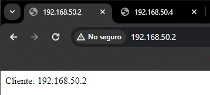
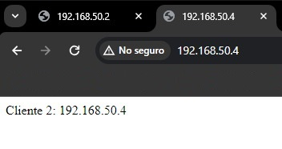
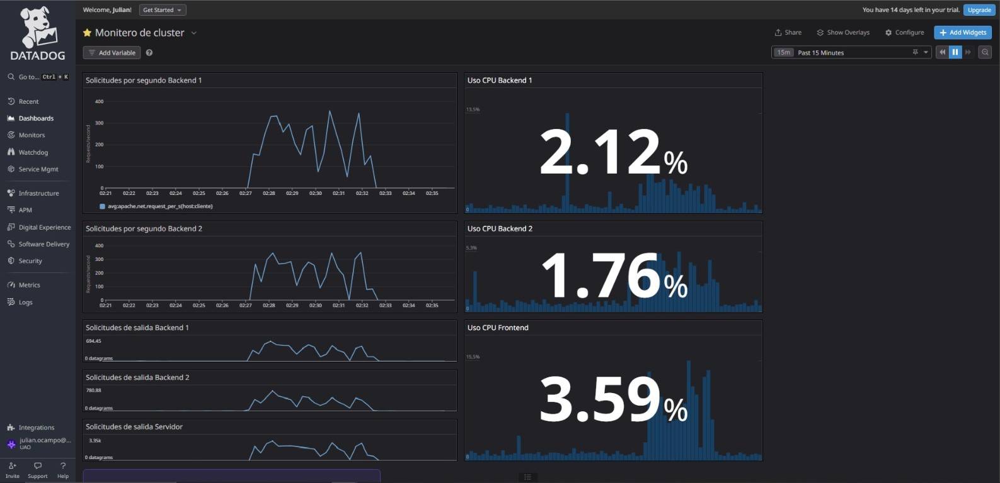
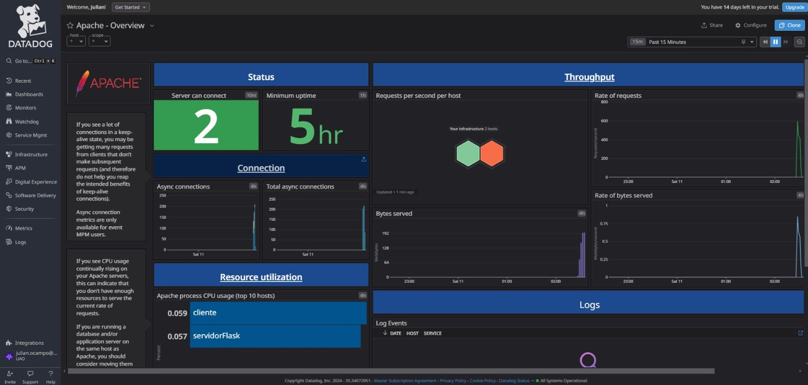
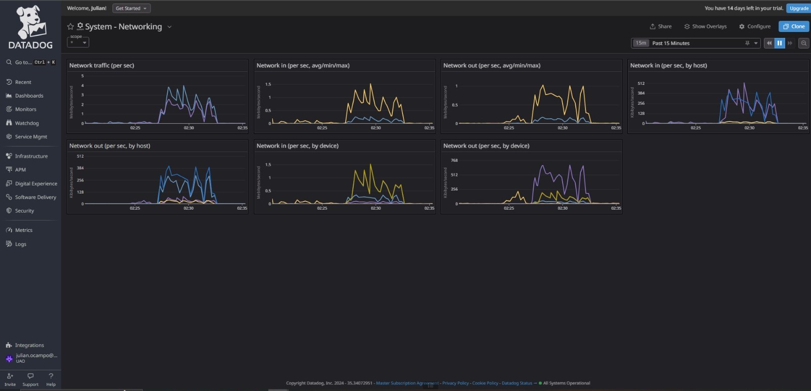

# Balanceador de carga con haproxy y Datadog

## Descripción.
Este proyecto proporciona una guía detallada sobre la configuración de un balanceador de cargas utilizando HAProxy junto con tres máquinas Virtuales Ubuntu 22.04. Además, se integra Datadog como una interfaz de monitoreo para evaluar el rendimiento de una de las máquinas, en particular, el servidor HAProxy.

## Requisitos previos
Antes de comenzar con la configuración del balanceador de cargas, se deben tener en cuenta los siguientes requisitos:

1. Tener tres máquinas virtuales de Ubuntu instaladas y configuradas en la misma red.
2. Tener privilegios de superusuario en las tres máquinas, que para eso se usa el comando "sudo -i".
3. Tener instalado HAProxy en la máquina que actuará como balanceador de cargas.
4. Crear una cuenta en la página oficial de Datadog: https://www.datadoghq.com/ e instalar la aplicación.

## Creacion del archivo Vagrantfile
Se debe ejecutar el comando `Vagrant init` para crear el archivo y se configura asi en cualquier editor de texto:

	# -- mode: ruby --
	# vi: set ft=ruby :

	Vagrant.configure("2") do |config|

		if Vagrant.has_plugin? "vagrant-vbguest"
			config.vbguest.no_install = true
			config.vbguest.auto_update = false
			config.vbguest.no_remote = true
	  	end
	        config.vm.define :servidorWeb do |servidorWeb|
	                servidorWeb.vm.box = "bento/ubuntu-22.04"
			servidorWeb.vm.network :private_network, ip: "172.16.0.3"
	                servidorWeb.vm.network :private_network, ip: "192.168.60.3"
			servidorWeb.vm.network :public_network, bridge: "ethp", :dhcp => true
	                servidorWeb.vm.hostname = "servidorWeb"
	                servidorWeb.vm.boot_timeout = 1000
	        end
	        config.vm.define :cliente do |cliente|
	                cliente.vm.box = "bento/ubuntu-22.04"
	                cliente.vm.network :private_network, ip: "192.168.50.2"
			cliente.vm.network :forwarded_port, guest: 80, host:5567
			cliente.vm.network :forwarded_port, guest: 443, host:5568
	                cliente.vm.hostname = "cliente"
	                cliente.vm.boot_timeout = 1000
	        end
	        config.vm.define :servidorFlask do |servidorFlask|
	                servidorFlask.vm.box = "bento/ubuntu-22.04"
	                servidorFlask.vm.network :private_network, ip: "192.168.50.4"
	                servidorFlask.vm.hostname = "servidorFlask"
	                servidorFlask.vm.boot_timeout = 1000
	        end
	end

Una vez se haya configurado el archivo Vagrantfile, se procede a ejecutar el comando vagrant up para crear las tres máquinas virtuales. Se recomienda deshabilitar firewall con: sudo ufw disable.

# Configuración.
## Configuración de las máquinas virtuales.
1. Configuración de la primera máquina virtual

* Nombre de la maquina: servidorWeb 
* IP: 192.168.60.3
* Sistema operativo: Ubuntu 22.04
* Servidor  instalado: haproxy y datadog-agent
* Si se tiene Apache o Nginx pararlos o desinstalarlos debido a que esto interfiere en el desarrollo.

**Para configurar HAProxy en el sistema, sigue los pasos a continuación**:

- Actualizar la lista de paquetes: Antes de instalar cualquier paquete, es una buena práctica actualizar la lista de paquetes disponibles. Abre una terminal y ejecuta: `sudo apt update`

- Instala los compiladores y dependencias necesarias utilizando el siguiente comando: `sudo apt install gcc libpcre3-dev tar make -y`.

- Instala haproxy en tu máquina utilizando el siguiente comando: `sudo apt-get install -y haproxy`.

- Finalmente, inicia el servicio de HAProxy: `sudo systemctl start haproxy`.

Con estos pasos, habrás instalado y configurado HAProxy en tu sistema Ubuntu. Asegúrate de haber ejecutado los comandos con permisos de superusuario o con el uso del comando sudo cuando sea necesario.

2. Configuración de la segunda máquina virtual
* Nombre de la maquina: backend1
* IP: 192.168.50.2
* Sistema operativo: Ubuntu 22.04
* Servidor web instalado: Apache  
Se debe instalar el servicio de apache2 con el siguiente comando: `sudo apt-get install apache2`, una vez instalado se debe crear un archivo index.html el cual se crea en la ruta `/var/www/html` y por ultimo se Ejecuta el siguiente comando para iniciar el servicio de Apache: `sudo systemctl start apache2`.
 

3. Configuración de la tercera máquina virtual
* Nombre de la maquina: backend2
* IP: 192.168.50.4
* Sistema operativo: Ubuntu 22.04
* Servidor web instalado: Apache  
Se debe instalar el servicio de apache2 con el siguiente comando: `sudo apt-get install apache2` una vez instalado se debe crear un archivo index.html el cual se crea en la ruta `/var/www/html` y por ultimo se Ejecuta el siguiente comando para iniciar el servicio de Apache: `sudo service apache2 start`.

# Configuración del balanceador de cargas

1. Ingresa al directorio correspondiente: `cd /etc/haproxy`. Configura el archivo `sudo vim haproxy.cfg`.
2. Configurar el archivo de la siguiente manera:

		global
		        log /dev/log    local0
		        log /dev/log    local1 notice
		        chroot /var/lib/haproxy
		        stats socket /run/haproxy/admin.sock mode 660 level admin expose-fd listeners
		        stats timeout 30s
		        user haproxy
		        group haproxy
		        daemon
		
		defaults
		        log     global
		        mode    http
		        option  httplog
		        option  dontlognull
		        timeout connect 5000
		        timeout client  50000
		        timeout server  50000
		        errorfile 400 /etc/haproxy/errors/400.http
		        errorfile 403 /etc/haproxy/errors/403.http
		        errorfile 408 /etc/haproxy/errors/408.http
		        errorfile 500 /etc/haproxy/errors/500.http
		        errorfile 502 /etc/haproxy/errors/502.http
		        errorfile 503 /etc/haproxy/errors/503.http
		        errorfile 504 /etc/haproxy/errors/504.http
		
		frontend http_front
		        bind *:80
		        stats enable
		        stats uri /haproxy?stats
		        #stats auth admin:admin
		        default_backend http_back
		
		backend http_back
		        balance roundrobin
		        server cliente 192.168.50.2:80 check
		        server servidorFlask 192.168.50.4:80 check
		
		frontend stats
		        bind *:8404
		        stats enable
		        stats uri /metrics
		        stats refresh 10s
		        stats show-node
		        stats show-legends
		        stats admin if TRUE
		        default_backend http_back

3. Se instala datadog-agent en las 3 máquinas virtuales luego de iniciar sesión en la página de la siguiente manera:

Se genera una API Key, se selecciona y se copia este codigo en las 3 VM: `sudo DD_API_KEY=XXXXXXXXXXXXXXXXXXXXXXXXXXXXXXXX DD_SITE="us5.datadoghq.com"  bash -c "$(curl -L https://s3.amazonaws.com/dd-agent/scripts/install_script_agent7.sh)"`.
Si se presenta algún error se recomienda eliminir estos archivos y luego volver a ejecutar el comando anterior:
- Dentro del directorio: "/etc/haproxy" eliminar el "ddagent-install.log".
- Dentro del directorio: "/tmp" eliminar cualquier archivo de texto.

4. Vamos al directorio `/etc/datadog-agent/conf.d/haproxy.d/conf.yaml`, Este codigo es el enlace de Datadog con Haproxy.
- Lo modificamos de la siguiente manera:

		init_config:

		instances:
		  - url http://192.168.50.3:8404/metrics
- Verificar la conectividad: Comprueba que la máquina donde se está ejecutando el agente de Datadog puede acceder a la URL configurada. Puedes hacerlo usando curl desde la máquina servidor: `curl http://192.168.60.3:8404/metrics`

5. Reiniciar HAProxy y Datadog para aplicar los cambios, para esto se utiliza este codigo `sudo systemctl restart haproxy`, `sudo systemctl restart datadog-agent`.

6. Se accede a la ip de la máquina frontend por medio de un buscador: `"http://192.168.60.3:8404/metrics"`.
  

**Configuración de Apache en clientes**

Cliente y Cliente2: (cliente y servidorFlask)

- Maquina cliente y cliente2 modificamos el archivo: `sudo vim /etc/apache2/apache2.conf`
- Despues de instalar, se debe de habilitar un modulo que se llama status: `sudo a2enmod status`

- En el archivo apache2.conf se agrega lo siguiente:
  
		<Location /server-status>
  			SetHandler server-status
        		Require all granted
		</Location>
		ExtendedStatus On

**Integracion de la Maquinas clientes**

Cliente: 

- Maquina cliente: `sudo vim /etc/datadog-agent/conf.d/apache.d/conf.yaml`

		init_config:

		instances: 

	  	  - apache_status_url: http://192.168.50.2/server-status?auto

 Cliente 2:

 - Maquina cliente2: `sudo vim /etc/datadog-agent/conf.d/apache.d/conf.yaml`

		init_config:

		instances: 

	  	  - apache_status_url: http://192.168.50.4/server-status?auto
   
# Instrucciones de uso
Para usar el balanceador de cargas con HAProxy y tres máquinas de Ubuntu 22.04, a continuación se detallan los siguientes pasos:

1. Accede al balanceador de cargas a través de su dirección ip en el navegador, en este caso es la maquina con el nombre de servidor "192.168.60.3".
2. La solicitud será dirigida a uno de los dos servidores web de manera aleatoria asi:

# Configuración de Datadog

Una vez creada la cuenta en la página oficial, y descargarla en tus VM se verá algo asi en tu infraestructura:

Tener en cuenta observar estas instalaciones:

1. luego vamos al apartado de dashboards y damos click en new dashboard y creamos.
   

2. Una vez creado el dashboard se personaliza a los que necesitemos.

* Dashboard de monitoreo de cluster personalizado

3. Por ultimo seleccionamos el tipo de grafico deseado, para luego mostrarlo.

Se guarda el grafico para asi tener todo en tu cuenta y si se quiere se puede modificar a gusto. Para este caso se han creado y analizado los siguientes gráficos:

* Dashboard de monitoreo de HAproxy

* Dashboard de monitoreo de Apache

* Dashboard de monitoreo de las métricas del sistema

# Contacto e información
Si surgen preguntas o sugerencias sobre este proyecto, por favor contáctame a mi correo electrónico: julian.ocampo@uao.edu.co.
